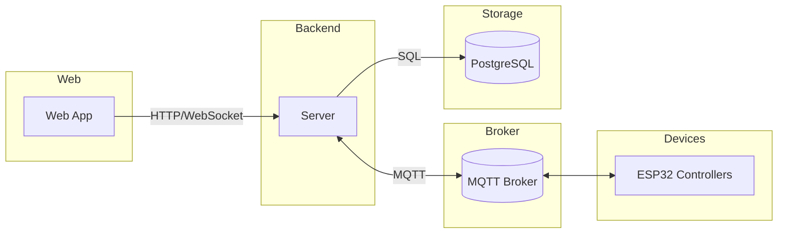
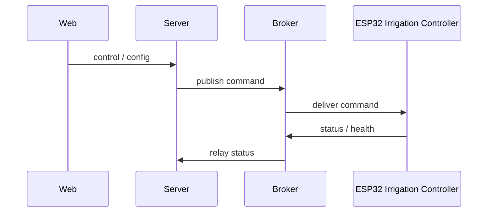
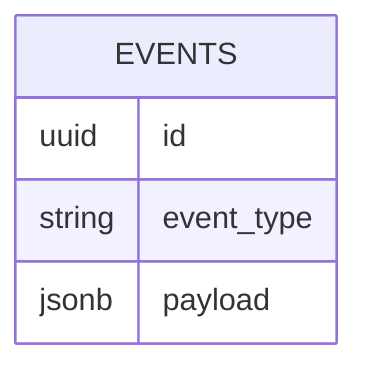

# ESP32-MQTT-control

Control of ESP32 microcontrollers via MQTT using a web app and Node.js backend.

## Architecture



### Irrigation controller



#### MQTT message schema

Commands and telemetry for the irrigation controller are published to topics
such as `irrigation/<id>/control` or `irrigation/<id>/status`. The MQTT topic is
part of the message envelope handled by the broker and **is not included in the
JSON payload**. Each payload is a JSON object with the following fields:

| Field | Type | Description | Example |
|-------|------|-------------|---------|
| `message` | string or object | Payload specific to the topic. See below for irrigation message formats. | `"HIGH"` |
| `timestamp` | string (ISO 8601) | When the sender generated the message. | `2024-01-01T12:00:00.123Z` |

##### Control / status topics (`irrigation/<id>/control`, `irrigation/<id>/status`)

| Field | Type | Description |
|-------|------|-------------|
| `message` | string | `"HIGH"` to open the valve, `"LOW"` to close it. |

Publish to `irrigation/<id>/control` with payload:

```json
{
  "message": "HIGH",
  "timestamp": "2024-01-01T12:00:00.123Z"
}
```

##### Config topic (`irrigation/<id>/config`)

| Field | Type | Description |
|-------|------|-------------|
| `message.highDuration` | number (ms) | Duration the valve stays open; firmware clamps to safe bounds. |
| `message.heartbeatInterval` | number (minutes) | Interval between controller health pings. |

Publish to `irrigation/<id>/config` with payload:

```json
{
  "message": {
    "highDuration": 3000,
    "heartbeatInterval": 5
  },
  "timestamp": "2024-01-01T12:00:00.123Z"
}
```

##### Health topic (`irrigation/<id>/controllerhealth`)

| Field | Type | Description |
|-------|------|-------------|
| `message.ipAddress` | string | Current IP address reported by the controller. |

Publish to `irrigation/<id>/controllerhealth` with payload:

```json
{
  "message": {
    "ipAddress": "192.168.1.100"
  },
  "timestamp": "2024-01-01T12:00:00.123Z"
}
```
## Database schema



## Server logging

The server connects to the configured MQTT broker and forwards messages to a
PostgreSQL database. All events are written to a single table with an
`event_type` column, allowing different device domains (aircon, irrigation, etc.)
to be distinguished and extended later.

### Environment variables

- `MQTT_URL`, `MQTT_USERNAME`, `MQTT_PASSWORD` – broker connection details.
- `AIRCON_TOPIC`, `IRRIGATION_TOPIC` – topics to subscribe to; map to `aircon`
  and `irrigation` event types respectively.
- `EVENT_TABLE` – name of the PostgreSQL table receiving all events. It must
  have columns `id` (optional), `event_type`, and `payload` (JSONB).
- `DATABASE_URL` – PostgreSQL connection string.

Messages with a `recordId` field upsert into the table using that id; otherwise a
new row is inserted with the JSON payload.
